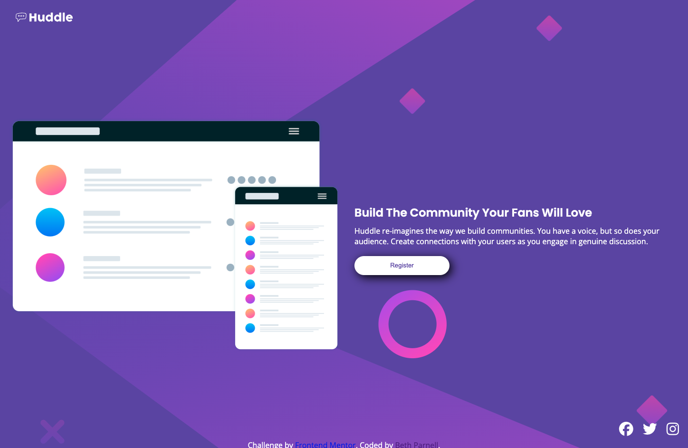

## Table of contents

- [Table of contents](#table-of-contents)
- [Overview](#overview)
  - [The challenge](#the-challenge)
  - [Screenshot](#screenshot)
  - [Links](#links)
- [My process](#my-process)
  - [Built with](#built-with)
- [Author](#author)

## Overview

### The challenge

Users should be able to:

- View the optimal layout for the page depending on their device's screen size
- See hover states for all interactive elements on the page

### Screenshot

### Links

- Solution URL: [Code Repository - GitHub](https://github.com/ejparnell/huddle_landing_page)
- Live Site URL: [Live Site - Hosted on GitHub](https://ejparnell.github.io/huddle_landing_page/)

## My process

### Built with

- Semantic HTML5 markup
- CSS custom properties
- Flexbox
- CSS Grid
- Mobile-first workflow

## Author

- Website - [Beth Parnell](https://www.your-site.com)
- LinkedIn - [@elizabethjparnell](https://www.linkedin.com/in/elizabethjparnell/)
